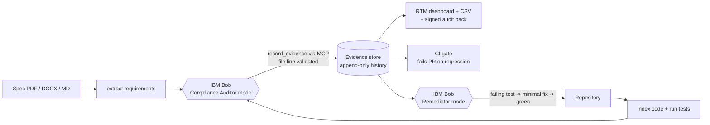

# TraceProof

**Green CI isn't compliance.** TraceProof audits a code repository against its requirements document and produces a verified, auditor-ready **Requirements Traceability Matrix (RTM)** in minutes. It uses **IBM Bob 2.0** to find spec drift that passing tests miss, closes the gaps test-first, and keeps them closed on every pull request.

[](https://github.com/TanishqCh07/traceproof/actions/workflows/traceproof.yml)

> Built for the **IBM Bob 2.0 Hackathon** (lablab.ai, Sept 2026) by team **SoloModel**.

---

## The problem

In regulated software (payments, banking, healthcare, automotive), teams must prove that **every requirement in the approved spec is implemented and tested**. That proof is an RTM, and today it is built **by hand in spreadsheets**: slow, stale by the next commit, and error-prone.

Worse, **green CI creates false confidence.** Our demo service, *PayFlow*, passes **11/11 tests**, yet against its 14-requirement spec:

| Req | Spec says | Code did | Tests |
|---|---|---|---|
| PF-002 | Max ₹1,00,000 per payment | Allowed ₹2,00,000 | A passing test **asserted the wrong limit** |
| PF-005 | Refunds within 30 days | Allowed 60 days | None |
| PF-008 | Never log full card numbers (PCI-DSS) | **Logged the full PAN** | None |
| PF-011 | 2FA above ₹50,000 | Not implemented | None |
| PF-004 / 009 / 013 | Implemented correctly | — | Never tested |

**Only 7 of 14 requirements (50%) were actually proven.** No tool in the pipeline noticed.

## The solution



1. **Understand the spec.** Extracts every requirement (ID, area, priority, text) from PDF/DOCX/Markdown, including tables that wrap across rows.
2. **Map the code.** AST-indexes functions, constants and tests (file:line) and runs the real test suite.
3. **Verify with Bob.** A custom **🛡️ Compliance Auditor** mode compares code *literally* against the spec (30 vs 60 days, 1,00,000 vs 200000) and returns one of five verdicts: `COVERED`, `UNTESTED`, `DRIFT`, `VIOLATION`, `MISSING`.
4. **Evidence, not opinions.** Verdicts are recorded through TraceProof's own **MCP server**, which **rejects any file:line reference that does not exist**. That is our anti-hallucination guard. History is append-only.
5. **Close the gaps.** A **🔧 Remediator** mode fixes each gap test-first: a failing test named after the requirement, the minimal fix, then the full suite.
6. **Keep it closed.** A GitHub Action re-scans on every push/PR and **fails the build** if coverage drops or a violation appears.

## Results on PayFlow

| Metric | Result |
|---|---|
| Audit verdict accuracy vs ground truth ([`docs/ANSWER_KEY.md`](docs/ANSWER_KEY.md)) | **14 / 14 correct** |
| Defects found that green CI missed | **4** (2 drift, 1 PCI violation, 1 missing control) + 3 untested |
| Proven coverage | **50% → 100%** after Bob remediation |
| PayFlow tests | 11 → **27** (all passing) |
| Audit run (Bob) | ~5 min, ~1.9 Bobcoins |
| Remediation run (Bob) | ~6 min, ~2.2 Bobcoins |
| Regression PR ([#1](https://github.com/TanishqCh07/traceproof/pull/1)) | **Blocked by CI** — PF-005 downgraded, coverage 92.9% |
| Bonus | The CI gate caught a **flaky boundary test** that passed on Windows but failed on Linux |

The committed audit evidence and dashboard live in [`demo/payflow/.traceproof/`](demo/payflow/.traceproof/). Download `reports/rtm.html` and open it locally, or grab the `traceproof-rtm` artifact from any CI run.

## How IBM Bob is used

| Bob feature | Where |
|---|---|
| **Custom modes** | [`.bob/custom_modes.yaml`](.bob/custom_modes.yaml): 🛡️ Compliance Auditor (can only edit evidence/reports/tests) and 🔧 Remediator (test-first loop) |
| **Skills** | [`.bob/skills/trace-audit/`](.bob/skills/trace-audit/): verdict definitions, literal-comparison rules, sign-off checklist |
| **MCP** | [`traceproof/mcp_server.py`](traceproof/mcp_server.py): 8 tools incl. `record_evidence_batch`, wired via [`.bob/mcp.json`](.bob/mcp.json) |
| **Slash commands** | [`.bob/commands/audit.md`](.bob/commands/audit.md), [`remediate.md`](.bob/commands/remediate.md) |
| **Rules / AGENTS.md** | [`.bob/rules/`](.bob/rules/), [`AGENTS.md`](AGENTS.md) (generated by `/init`) |
| **Plan → Agent workflow** | Architecture planned in Plan mode ([`docs/ARCHITECTURE.md`](docs/ARCHITECTURE.md)), built in Agent mode |
| **Document understanding** | Bob reads the SRS PDF and reconciles it with the extractor |

Every Bob task session summary is in [`bob_sessions/`](bob_sessions/), and each build step is logged in [`docs/BUILD_LOG.md`](docs/BUILD_LOG.md).

## Quick start

```bash
git clone https://github.com/TanishqCh07/traceproof && cd traceproof
python -m venv .venv && source .venv/bin/activate      # Windows: .venv\Scripts\activate
pip install -e . pytest

traceproof scan   --spec demo/specs/PayFlow_SRS_v1.2.pdf --repo demo/payflow
traceproof report --repo demo/payflow --spec demo/specs/PayFlow_SRS_v1.2.pdf --open
traceproof check  --repo demo/payflow --min-coverage 100    # exit 1 = gate fails
python -m pytest -q                                          # 148 tests
```

**Using it with Bob:** open the repo in Bob IDE and update the absolute paths in `.bob/mcp.json` to your checkout and virtualenv. Confirm **Settings → MCP → traceproof = Connected**, then choose the 🛡️ Compliance Auditor mode and run:

```
/audit demo/specs/PayFlow_SRS_v1.2.pdf demo/payflow
```

## Project layout

```
traceproof/        extract · index · runner · store · matrix · report · cli · mcp_server
tests/             148 offline tests
demo/payflow/      sample payments service (the audit target) + committed audit evidence
demo/specs/        PayFlow_SRS_v1.2.pdf (14 requirements)
.bob/              custom modes, skill, rules, commands, MCP config
.github/workflows/ CI compliance gate
bob_sessions/      IBM Bob task session summaries
docs/              architecture, build log, answer key, submission texts
```

## Limitations and next steps

- Python repositories only today; Java/Go indexers are next.
- Requirements import from Jira / Polarion / DOORS.
- Templates for ISO 26262, IEC 62304 and RBI/PCI audits.
- Spec-version diff: re-verify only requirements that changed between v1.2 and v1.3.
- watsonx.ai Granite as a headless judge for CI-only runs.

## Data

All data is synthetic. PayFlow and its SRS were written for this project. `4111111111111111` is the industry-standard test card number. No personal or client data is used.

## License

MIT
