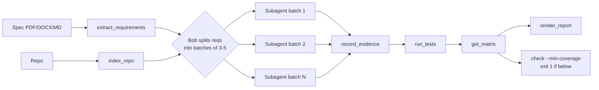

# TraceProof — Architecture

> One-page reference for engineers building or extending the tool.

---

## Package Layout

```
traceproof/
  models.py       ← Single source of truth: Requirement, CodeRef, TestRef, Evidence, Verdict
  extract.py      ← Parse spec (PDF/DOCX/MD) → list[Requirement]
  index.py        ← Walk repo → symbol table + test index (CodeRef, TestRef)
  runner.py       ← Invoke pytest, capture pass/fail per test node
  matrix.py       ← Join Evidence records → RTM; compute coverage %
  report.py       ← Jinja2 → HTML/Markdown RTM report
  cli.py          ← `traceproof scan | report | check` entry point
  mcp_server.py   ← FastMCP server exposing the seven audit tools
  llm.py          ← Optional LLM judge (interface + no-LLM fallback)

tests/            ← Offline unit tests; must complete in < 10 s
demo/payflow/     ← Audit target (read-only unless remediating)
demo/specs/       ← PayFlow_SRS_v1.2.pdf
.traceproof/
  evidence.json   ← Append-only evidence store (one record per requirement)
docs/
  BUILD_LOG.md    ← 2-line entry appended after every task
  ARCHITECTURE.md ← This file
```

---

## Data Model (`traceproof/models.py`)

```
Verdict (str, Enum)
  COVERED    – code implements it AND a passing test asserts the exact behaviour
  UNTESTED   – code implements it, no test asserts it
  DRIFT      – close but wrong threshold / error code / window
  VIOLATION  – code does the opposite of a SHALL NOT requirement
  MISSING    – no implementation found

Requirement
  req_id: str          # e.g. "PF-005"
  text:   str          # full requirement sentence from spec
  area:   str          # logical group (payments, refunds, security …)

CodeRef
  req_id: str
  path:   str          # repo-relative path
  line:   int
  symbol: str          # function / class name

TestRef
  req_id: str
  path:   str
  line:   int
  node:   str          # pytest node id
  passed: bool | None  # None = not yet run

Evidence
  req_id:    str
  verdict:   Verdict
  code_refs: list[CodeRef]
  test_refs: list[TestRef]
  rationale: str        # one sentence
  severity:  str        # Critical | High | Medium | Low
  timestamp: str        # UTC ISO-8601
```

---

## Evidence Store (`.traceproof/evidence.json`)

Newline-delimited JSON (one object per line, newest last).  
Each `record_evidence` call **appends** a new record; history is never mutated.  
`get_matrix` and `get_gaps` fold the log by `req_id`, taking the **latest** record per requirement.

```jsonc
{"req_id":"PF-005","verdict":"DRIFT","code_refs":["payflow/service.py:19"],
 "test_refs":[],"rationale":"REFUND_WINDOW is 60 days; spec requires 30.","severity":"High",
 "timestamp":"2025-01-01T00:00:00+00:00"}
```

---

## MCP Tools (`traceproof/mcp_server.py`)

| Tool | Input | Output |
|---|---|---|
| `extract_requirements` | `spec: path` | `list[Requirement]` |
| `index_repo` | `repo: path` | symbol + test index |
| `run_tests` | `repo: path` | pass/fail per `TestRef` |
| `record_evidence` | `Evidence` fields | appends to evidence store |
| `get_matrix` | _(none)_ | full RTM (latest verdict per req) |
| `get_gaps` | `min_severity?` | requirements not COVERED |
| `render_report` | `output: path, format: html\|md` | rendered report path |

`extract_requirements` and `index_repo` are in `alwaysAllow` (`.bob/mcp.json`).

---

## CLI (`traceproof/cli.py`)

```
traceproof scan   --spec <file> --repo <dir>   # extract + index + audit via subagents → evidence
traceproof report --output <file> [--format html|md]
traceproof check  --min-coverage <N>           # exit 1 if coverage % < N  (CI gate)
```

---

## Audit Flow



Each subagent: locates code → compares constants literally against spec → locates tests → returns verdict + rationale.

---

## Key Constraints

- No network calls in core logic; LLM judge in `llm.py` is opt-in.
- All paths are arguments (`--spec`, `--repo`); no hard-coded demo paths.
- Tests offline, < 10 s total.
- Production code in `demo/payflow/` is read-only during audit; changes only via Remediator mode.
